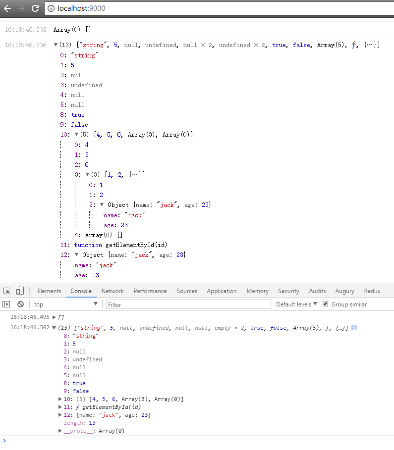
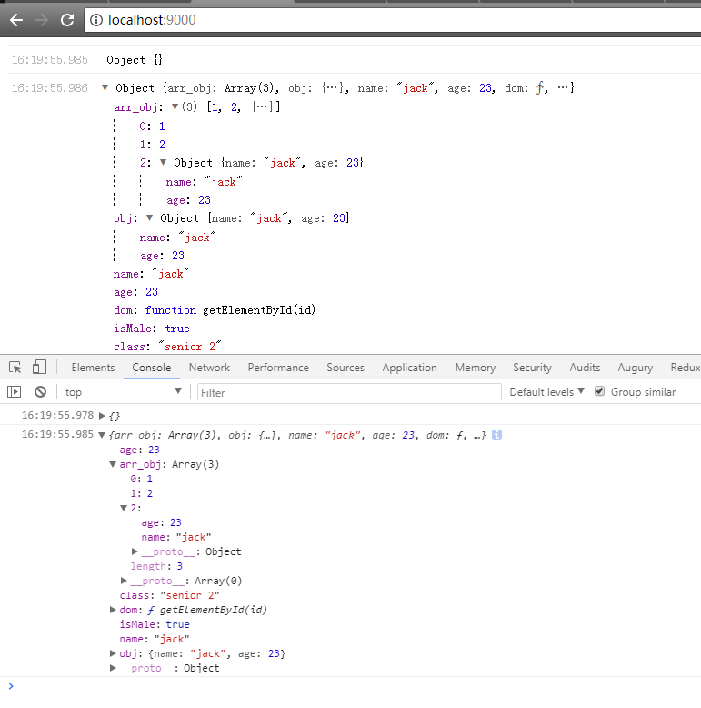

## Console-In-Dom
> now is not npm publish! i will publish it next free days.

> i'm a npm package newbie but not always.
### Basic TYPE Screenshot


### Array TYPE Screenshot


### Object TYPE Screenshot


### use static resourse directly
```html
link
<!DOCTYPE html>
<html lang="en">
<head>
  <meta charset="UTF-8">
  <meta name="viewport" content="width=device-width, initial-scale=1.0">
  <meta http-equiv="X-UA-Compatible" content="ie=edge">
  <link rel="stylesheet" href="../dist/demo/console.css">
  <title>jsConsole</title>
</head>
<body>
  <div id="console_output"></div>
  <script src="../dist/global/ConsoleInDom.js"></script>
  <script>
    var Console = ConsoleInDom.render();
    Console.log(window);
  </script>
</body>
</html>
```

### other Module
```javascript
//default render to document.body
var Console = require('ConsoleInDom').render();
var Console = require('ConsoleInDom').render(
  document.getElementById('output-render')
);

// OR
import { ConsoleInDom } from 'ConsoleInDom';
var Console = ConsoleInDom.render();
var Console = ConsoleInDom.render(
  document.getElementById('output-render')
);
```